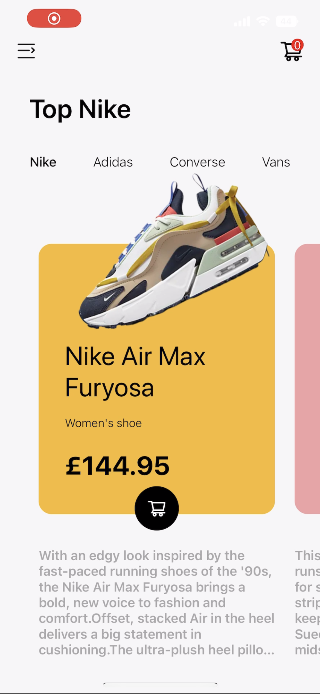
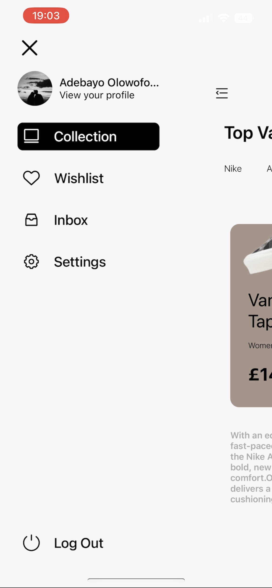
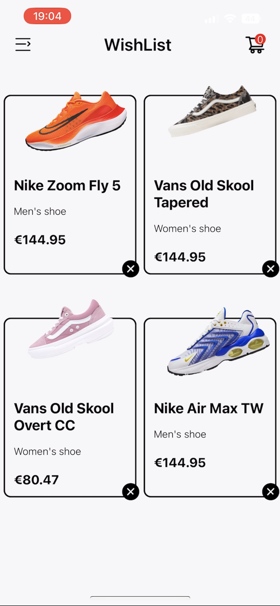
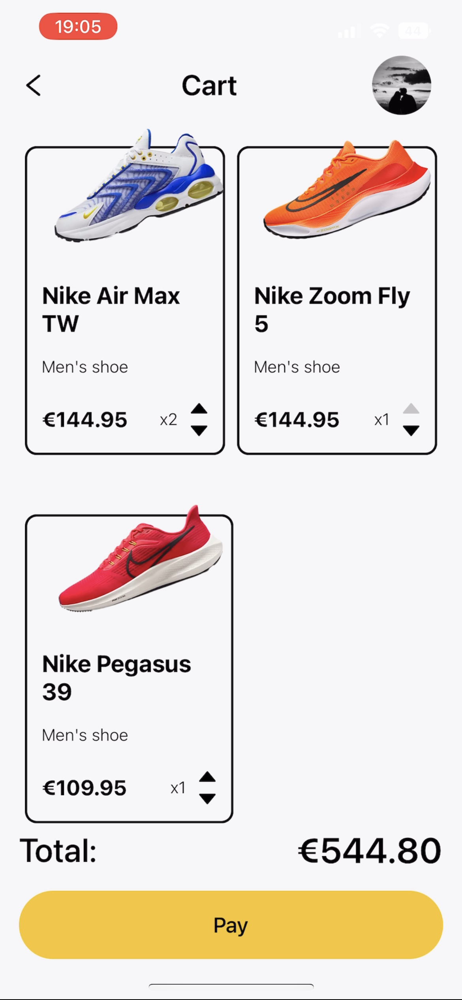

# **E-commerce App**

This is an ecommerce app for buying shoes built with react native.

## Here's the result

https://github.com/Olowodev/car-app/assets/99045599/2660c0d0-0cbc-4463-8ed4-eec9d15a120a

 

## Static shots of the app screens

 

### Features

- Has a home page featuring different shoes, their prices and description categorized by their brand
- Has an animated sidebar navigation for immersive user experience
- Has an "instagram double tap to like" feature that users can use to add shoes to their wish list
- Allows users to change both language and currency
- Features a cart for purchasing of the shoes
- Also features lazy loading for images

### Stack used

- React Native
- Expo
- TypeScript
- Reanimated
- Redux toolkit
